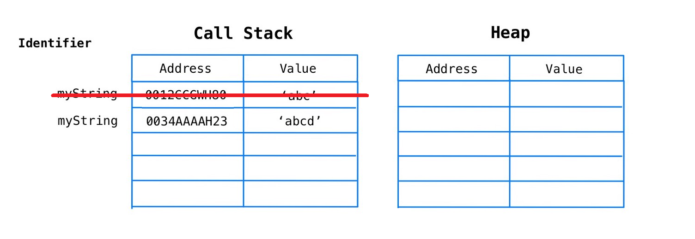
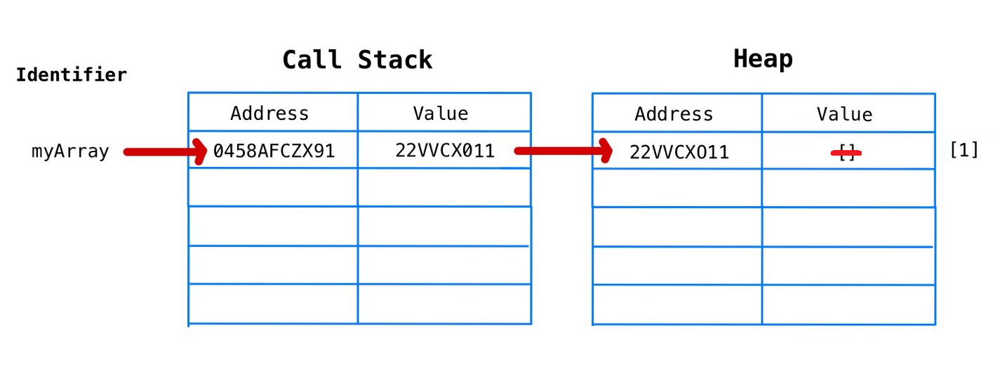

- General

  - [Interview strategy](strategy.md)

  - [Big O](theory/big-o.md)

- Algorithms and data strucutres

  - [Algorithms](algo.md)

  - [Advanced](advanced.md)

  - [Data structures](ds.md)

    - [BFS, DFS](theory/bfs-dfs.md)

- All you need to know about

  - [Core concepts](theory/core.md) (Global scope, Static scope, Dynamic scope, Closure, Hoisting, IIFE, `this`, `call`, `bind`, `apply`)

  - [Prototypal inheritance and OOP](theory/oop-proto-inheritance.md)

  - [Functional Programming](theory/fp.md)
  
  - [Asynchronous programming](theory/async.md)
  
  - [Modules](theory/modules.md)

- JavaScript types


  
- Like about JS

  - can do both FP and OOP (Haskell + Java)
  - author of js wanted to have both from Java and Scheme programming languages

- How Javascript Engine works


- Call stack

  - to store primitives (and function calls)
  - use `let` keyword to change memory adress



```js
let myString = 'abc'
    mystring = 'abcd'
```

- Memory heap

  - to store non-primitives
  - use `const` keyword to keep the same memory address, but change value



```js
const myArray = []
      myArray.push(1)
```