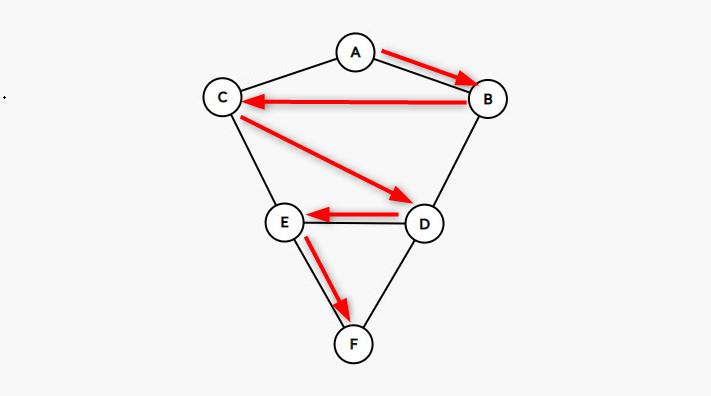
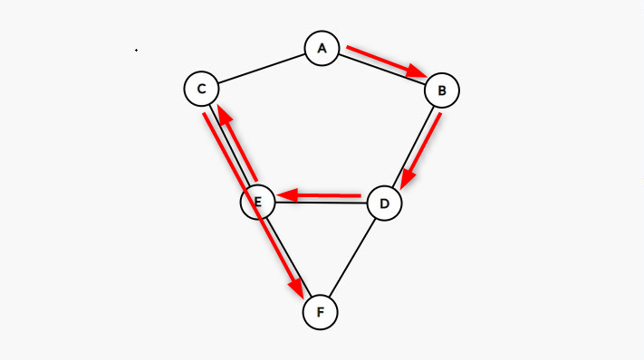
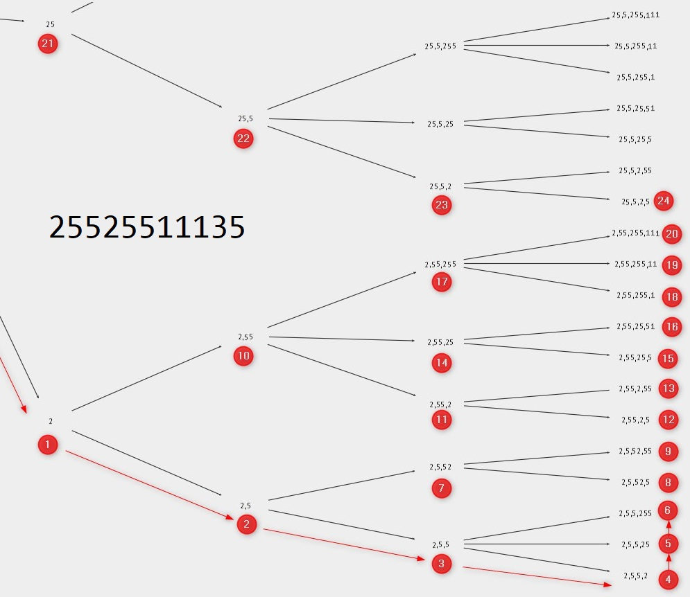
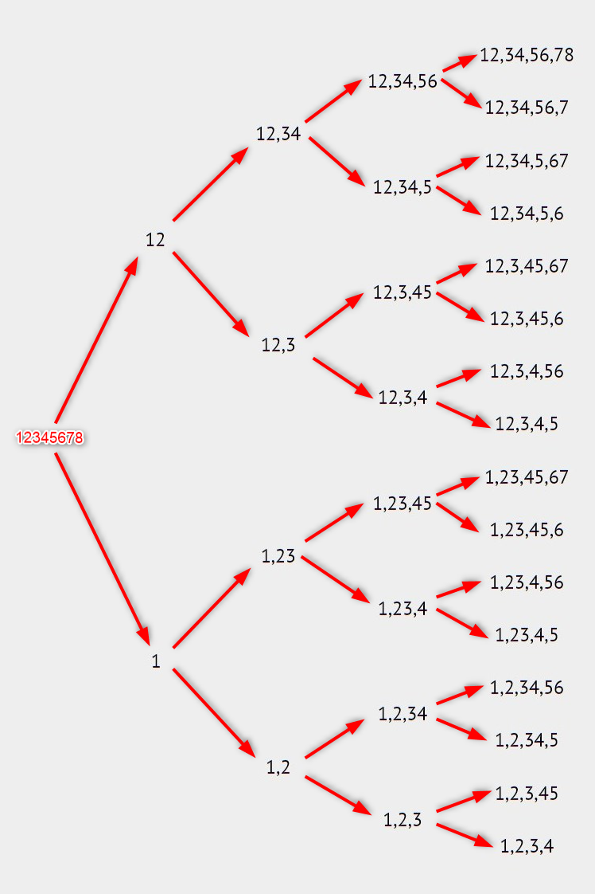
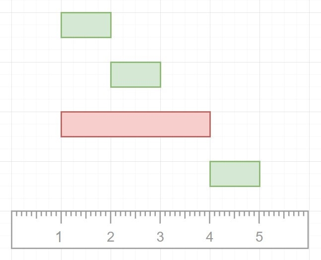

## BFS

We add nodes that we have discovered — but not yet visited — to our queue, and come back to them later

- based on Queue
- can be applied to any Binary Tree
- best for deep tree

<details>
<summary>Example</summary>


#### Binary search tree

```js
function bfs(root) {
    // init
    const queue = [];
    const visited = [];

    // add root
    queue.push(root);

    // as long as we have queue
    while (queue.length) {

        // deque
        const node = queue.shift();

        // add to visited
        visited.push(node.value);

        // enque children
        if (node.left) queue.push(node.left);
        if (node.right) queue.push(node.right);

    }

    return visited;
}
```

Level by level:
    
```js    
function bfsLevelByLevel(root) {

    // init
    const queue = [];
    const levels = [];

    // add root
    queue.push(root);

    // as long as we have queue
    while (queue.length) {

        // current level
        const level = [];

        // keep original length
        const queueLength = queue.length
    
        //////////////// LEVEL ////////////////

        for (let i = 0; i < queueLength; i++) {

            // deque
            const node = queue.shift();

            // enque children
            if (node.left) queue.push(node.left);
            if (node.right) queue.push(node.right);

            // add to level
            level.push(node.value);

        }

        //////////// END OF LEVEL ////////////

        // add to levels
        levels.push(level);

    }

    return levels;
}    
```
                                        
#### Graph



```js
function bfs(start) {
  const result = [];
  const visited = {};
  const queue = [start];
  // queue = ["A"]
  let currVertex;

  visited[start] = true;
  // visited = { "A": true }

  while (queue.length) {
    currVertex = queue.shift();
    // queue = []
    // currVertex = "A"
    result.push(currVertex);
    // result = ["A"]

    this.adjList[currVertex].forEach((neighbor) => {
      // neighbor = "B"
      // neighbor = "C"
      if (!visited[neighbor]) {
        visited[neighbor] = true;
        // visited = { "A": true, "B": true, "C": true }
        queue.push(neighbor);
        // queue = ["B", "C"]
      }
    });
  }

  return result;
}
```

</details>

## DFS

We add all left nodes recursively downwards and add new recursive calls to callstack, when bottom reached, javascript will pop last item from the callstack

- based on stack (last in — first out)
- best for wide tree

<details>
<summary>Example</summary>


#### Binary search tree

```js 
function traverseInOrder(tree) {
  const result = [];

  function dfs(node) {
    if (node) {
      if (node.left) dfs(node.left);
      result.push(node.value);
      if (node.right) dfs(node.right);
    }
  }

  dfs(tree.root);

  return result;
}
```

#### Graph



```js
function dfs(start) {
  const result = [];

  const visited = {};
  const adjList = this.adjList;
  /*
   *     adjList: {
   *       A: ["B", "C"],
   *       B: ["A", "D"],
   *       C: ["A", "E"],
   *       D: ["B", "E", "F"],
   *       E: ["C", "D", "F"],
   *       F: ["D", "E"],
   *     }
   */

  function traverse(vertex) {
    // vertex = "A"
    // vertex = "B"
    // vertex = "D"
    // vertex = "E"
    // vertex = "C"
    if (!vertex) return null;

    visited[vertex] = true;
    // visited = { "A": true }
    // visited = { "A": true, "B": true }
    // visited = { "A": true, "B": true, "D": true }
    // visited = { "A": true, "B": true, "D": true, "E": true }
    // visited = { "A": true, "B": true, "D": true, "E": true, "C": true }
    // visited = { "A": true, "B": true, "D": true, "E": true, "C": true, "F": true }

    result.push(vertex);
    // result = ["A"]
    // result = ["A", "B"]
    // result = ["A", "B", "D"]
    // result = ["A", "B", "D", "E"]
    // result = ["A", "B", "D", "E", "C"]
    // result = ["A", "B", "D", "E", "C", "F"]

    adjList[vertex].forEach((neighbor) => {
      if (!visited[neighbor]) {
        return traverse(neighbor);
        // traverse("B")
        // traverse("D")
        // traverse("E")
        // traverse("C")
      }
    });
  }

  traverse(start);
  // traverse("A")

  return result;
}
```

</details>

## Backtracking

Backtracking is implemented as DFS with pruning of branches based on constraints instead trying all possibilities (no brute-force).

<details>
<summary>Example</summary>



```js
function restoreIpAddresses(originalString) {
  // originalString = 25525511135
  const result = [];
  backtrack(0, []);
  return result;

  function backtrack(start, tempArr) {
    // push results - called 2 times
    if (tempArr.length === 4 && start === originalString.length) {
      result.push(tempArr.join("."));
      return;
    }

    // 4th level reached, don't go deeper
    if (tempArr.length === 4) {
      return;
    }

    // try 1-char, 2-char, 3-char long combinations
    for (let i = 1; i < 4; i++) {
      const segment = originalString.substring(start, start + i);

      if (segment.length > 1 && segment[0] === "0") {
        continue;
      }

      if (parseInt(segment) < 256 && parseInt(segment) >= 0) {
        // add another combination in current segment
        tempArr.push(segment);
        // try the whole IP address e.g.:
        // ["2", "5", "5", "2"]
        // ["2", "5", "5", "25"]
        // ["2", "5", "5", "255"]
        backtrack(start + i, tempArr);
        // remove sibling
        // ["2", "5", "5"]
        // ["2", "5", "5"]
        // ["2", "5", "5"]
        tempArr.pop();
      }
    }
  }
}

restoreIpAddresses("25525511135");
```

Simpler tree:



</details>

## Greedy

Make best choice at the moment.

- Break into subproblems
- Find optimal substructure (idea)
- Sort (time/distance/size)
- Solve greedily (iteration/recursion)

<details>
<summary>Example</summary>

- Break into subproblems ➡️ selection of events (select / remove)
- Find optimal substructure (idea) ➡️ every interval must finish as soon as possible to include more events
- Sort (time/distance/size) ➡️ sort by end time
- Solve greedily (iteration/recursion) ➡️ iterate



```js
function countOverlapIntervals(intervals) {
  if (intervals.length == 0) return 0;

  intervals.sort((a, b) => a[1] - b[1]);

  let overlapIntervals = 0;
  let lastEventEnd = intervals[0][1];

  for (let i = 1; i < intervals.length; i++) {
    const [currentEventStart, currentEventEnd] = intervals[i];

    if (currentEventStart < lastEventEnd) {
      // overlap, choose the one that finish first (remove biggest blocker)
      lastEventEnd = Math.min(currentEventEnd, lastEventEnd);
      overlapIntervals++;
    } else {
      // no overlap, update current event end
      lastEventEnd = currentEventEnd;
    }
  }

  return overlapIntervals;
}

countOverlapIntervals([
  [1, 2],
  [2, 3],
  [1, 4],
  [4, 5],
]);
```

</details>

## Divide and conquer

Optimizes by breaking down into simpler versions of itself.

<details>
<summary>Example</summary>

```js
function conquer(left, right) {
  let prefix = "";
  let index = 0;

  while (
    left[index] === right[index] &&
    index < left.length &&
    index < right.length
  ) {
    prefix = prefix + left[index];
    index++;
  }

  return prefix;
}

function longestCommonPrefix(items) {
  // base case
  if (items.length === 1) return items[0];

  // find center
  const center = Math.floor(items.length / 2);

  // divide
  const left = longestCommonPrefix(items.slice(0, center));
  const right = longestCommonPrefix(items.slice(center, items.length));

  // conquer
  const winner = conquer(left, right)
  return winner;
}
```

</details>

## Dynamic programming

Optimizes by caching solutions.

- breaking it down into a collection of simpler subproblems
- solving each of those subproblems just once
- storing their solutions

<details>
<summary>Example</summary>

```js
/*
  Normal
*/
function fib(n) {
  if (n <= 2) return 1;
  return fib(n - 1) + fib(n - 2);
}
```

```js
/*
 *  Memoized
 */
function fib(n, memo = []) {
  if (memo[n] !== undefined) return memo[n];
  if (n <= 2) return 1;
  var res = fib(n - 1, memo) + fib(n - 2, memo);
  memo[n] = res;
  return res;
}
```

```js
/*
 *  Tabulated
 */
function fib(n) {
  if (n <= 2) return 1;
  var fibNums = [0, 1, 1];
  for (var i = 3; i <= n; i++) {
    fibNums[i] = fibNums[i - 1] + fibNums[i - 2];
  }
  return fibNums[n];
}
```

</details>
