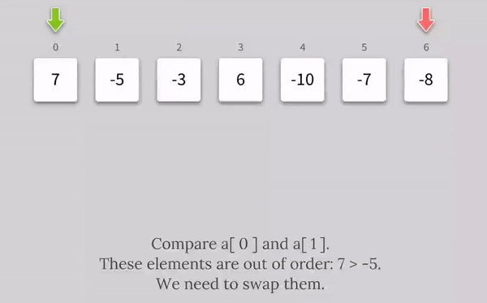
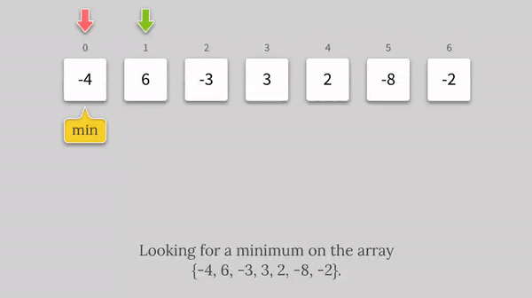
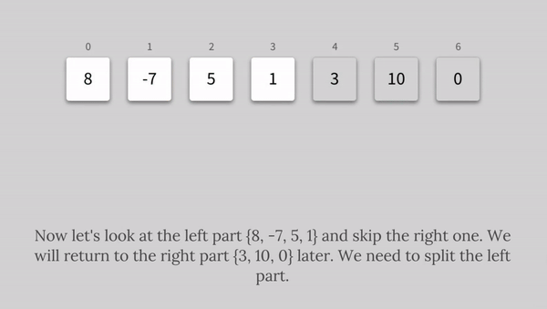
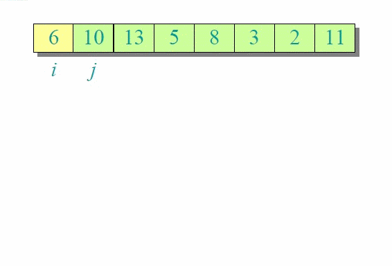
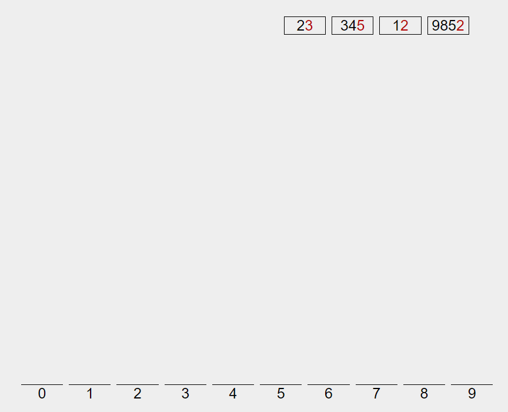

## Binary search

!> on sorted array only

define start, middle, end. Compare search term with middle: if they are not the same, redefine start, end and middle in the left or right part

O(1) ... O(log n) because we always split into 2 recursively

## String search

go parallely along two words, break loop after first mismatching letter. After whole second word finished, increase counter by 1.

## Bubble sort

```js
function swap(arr, i, j) {
  [arr[i], arr[j]] = [arr[j], arr[i]];
}
```



starting from first element compare couples and swap if necessary: every outer loop (going from end to start) will get one sorted item at the end.

```js
function bubbleSort(arr) {
  for (let i = arr.length - 1; i > 0; i--) {
    let noSwaps = true;

    for (let j = 0; j < i; j++) {
      if (arr[j] > arr[j + 1]) {
        swap(arr, j, j + 1);
        noSwaps = false;
      }
    }

    if (noSwaps) break;
  }

  return arr;
}
```

## Selection sort

```js
function swap(arr, i, j) {
  [arr[i], arr[j]] = [arr[j], arr[i]];
}
```



starting from first element (current, smallest) compare with the rest of array and found less than smallest, update smallest. At the end of inner loop swap current and smallest.

```js
function selectionSort(arr) {
  for (let i = 0; i < arr.length; i++) {
    let smallest = i;
    for (let j = i + 1; j < arr.length; j++) {
      if (arr[smallest] > arr[j]) {
        smallest = j;
      }
    }
    if (i !== smallest) {
      swap(arr, i, smallest);
    }
  }
  return arr;
}
```

## Insertion sort


starting from second element (current), increase subarray (considered as fully sorted) loop backwards in the inner loop copying bigger values forward. At the end of the inner loop, replace first duplicate by current

```js
function insertionSort(arr) {
  for (let i = 1; i < arr.length; i++) {
    let curr = arr[i];

    for (var j = i - 1; j >= 0 && arr[j] > curr; j--) {
      arr[j + 1] = arr[j];
    }

    arr[j + 1] = curr;
  }

  return arr;
}
```

## Merge sort



scan two arrays in parallel, compare every two items and push smallest of two

```js
function merge(arr1, arr2) {
  let result = [];
  let i = 0;
  let j = 0;

  while (i < arr1.length && j < arr2.length) {
    if (arr1[i] < arr2[j]) {
      result.push(arr1[i]);
      i = i + 1;
    } else {
      result.push(arr2[j]);
      j = j + 1;
    }
  }

  while (i < arr1.length) {
    result.push(arr1[i]);
    i = i + 1;
  }
  while (j < arr2.length) {
    result.push(arr2[j]);
    j = j + 1;
  }

  return result;
}
```

find middle element, recursively assign `left` and `right` to result of `mergeSort` untill array size becomes 0 or 1, then initiate `merge`

```js
function mergeSort(arr) {
  if (arr.length <= 1) {
    return arr;
  }

  let mid = Math.floor(arr.length / 2);
  let left = mergeSort(arr.slice(0, mid));
  let right = mergeSort(arr.slice(mid));

  return merge(left, right);
}
```

## Quick sort

```js
function swap(arr, i, j) {
  [arr[i], arr[j]] = [arr[j], arr[i]];
}
```



scan array starting after pivot element (swapIdx = 0) and compare every item with pivot element, for every smaller element found: first increase swapIdx and then swap it with element at swapIdx. After loop, finally swap pivot with element at swap index.

```js
function pivot(arr, left, right) {
  let pivot = arr[left];
  let swapIndex = left;

  for (let i = left + 1; i <= right; i++) {
    if (arr[i] < pivot) {
      swap(arr, ++swapIndex, i);
    }
  }

  swap(arr, left, swapIndex);

  return swapIndex;
}
```

recursively apply to parts before and after pivot element checking if `start` < `end`

```js
function quickSort(arr, start = 0, end = arr.length - 1) {
  if (start < end) {
    let pivotIndex = pivot(arr, start, end);
    quickSort(arr, start, pivotIndex - 1);
    quickSort(arr, pivotIndex + 1, end);
  }

  return arr;
}
```

## Radix sort

organise numbers based on current digit (right to left) that many times, how many digits in longest number



```js
function getDigit(num, i) {
  // num = 9852
  // i = 0
  return 2;
}

function digitCount(num) {
  // num = 9852
  return 4;
}

function mostDigits(nums) {
  // nums = [23,345,12,9852] 
  return 4;
}

function radixSort(nums) {
  // nums = [23,345,12,9852]

  let maxDigitCount = mostDigits(nums);
  // maxDigitCount = 4

  for (let k = 0; k < maxDigitCount; k++) {
    // k = 0

    let digitBuckets = Array.from({ length: 10 }, () => []);
    // digitBuckets = [[],[],[],[],[],[],[],[],[],[]]

    for (let i = 0; i < nums.length; i++) {
      
      let digit = getDigit(nums[i], k);
      // digit = 3

      digitBuckets[digit].push(nums[i]);

    }

    // digitBuckets = [[],[12, 9852],[],[23],[],[345],[],[],[],[]]

    nums = [].concat(...digitBuckets);
  }
  return nums;
}
```
