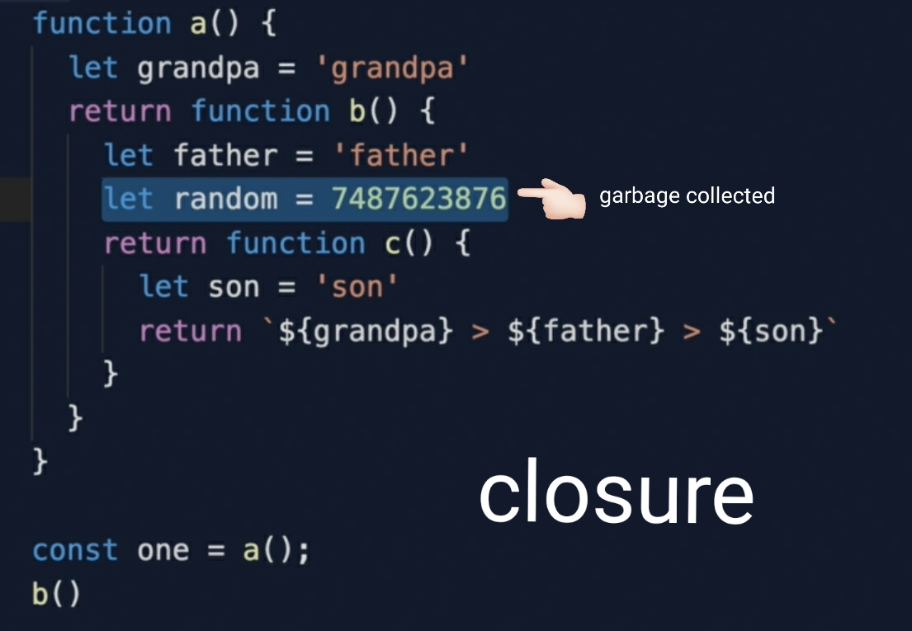
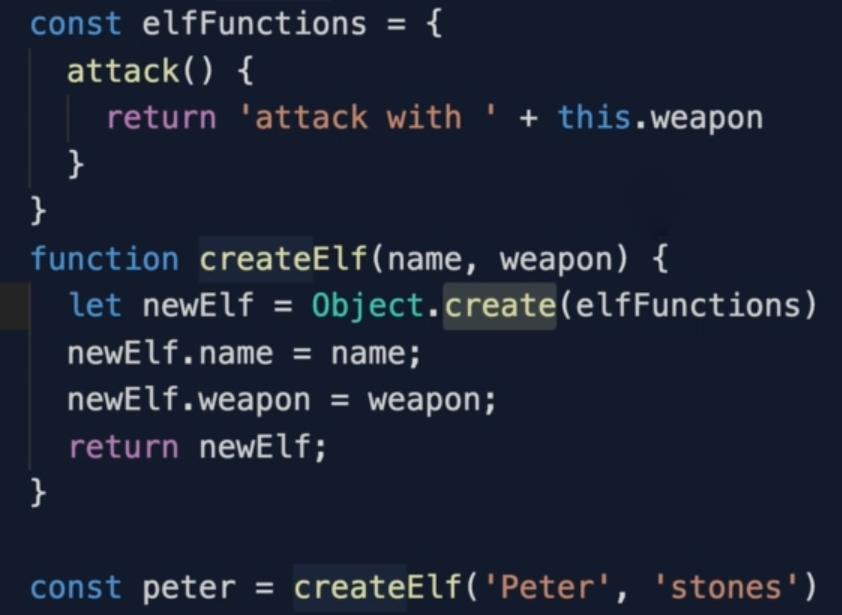
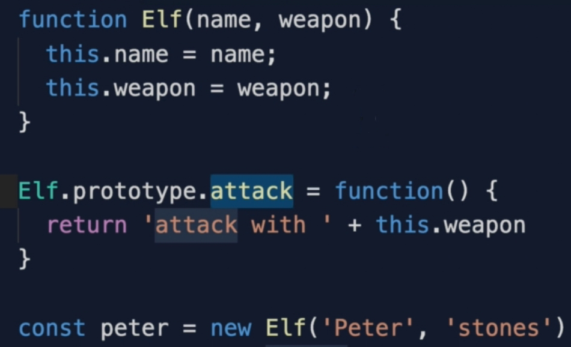
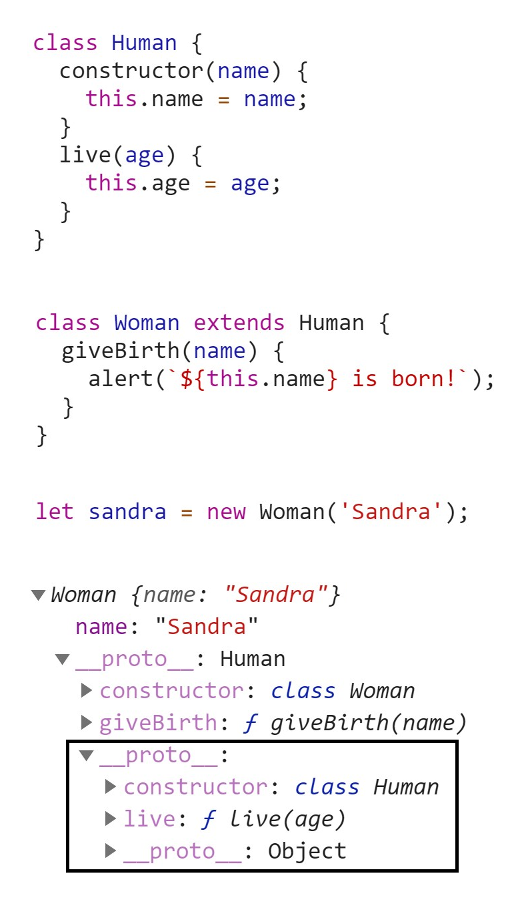

# Theory

## Time complexity:

- how long takes algorithm to run

  - O(1) - function require 1 step (access, assignment)

  - O(n) - function require n steps

  - O(n²) - function require n² steps (nested loop)

## Space complexity:

- how much space in memory does algorithm use

  - O(1) - function allocates static number of variables (independent from input)

  - O(n) - function allocates dynamic number of variables (dependent from input)

## Global execution scope

- Environment created before any javacript code is executed, consists of:

  - global `window` or `global` (Node.js) object

  - `this` object (equal to `window` or `global`)

  - `arguments` object

  - variable environment (all variable declarations)

## Static (lexical) scope

- write-time (detrmines variables solely based on their textual position in our code)

- based on nesting of scope

- the scope that can be determined statically at a write time

- only created when you create a new function (`{}`)

- extended by parent lexical scope walking up scope chain until global execution context

- can be accessed by `[[Scopes]]`

## Dynamic scope

- run-time

- based on callstack

- the scope that can be determined dynamicaly at a runtime

## Hoisting

- Act of moving of `function` or `var` to the top of the scope.

  - because javascript allocates space for them in a memory heap

  - during compilation phase

  - `var` initialized with `undefined`

  - `let` and `const` declarations remain uninitialized

## IIFE

- Design pattern to avoid namespace collisions.

  - used before modules were introduced

  - E means Expression, declaration starts with `function() {}`

  - you can pass a param to avoid scope chain lookup

## `this`

- The object that the property or function is property of.

  - refers to what is left to the dot `'.'`

  - the value of `this` can be determined by answering the question _"who called the function?"_

## `call`, `bind`, `apply`

- `call`

  - can be used for method borrowing, arguments are coma-separated

  - `originalObject.method.call(targetObject, argument1, argument2, ...)`

- `apply`

  - can be used for method borrowing, arguments are in `Array`

  - `originalObject.method.call(targetObject, [argument1, argument2, ... ])`

- `bind`

  - returns new function unlinke `call` or `apply`

  - allows to store in function for future use

  - `const method = originalObject.method.bind(targetObject, argument1, argument2, ...);`

## Currying

- Partially giving a function the parameters

  `const multiplyByTwo = multiply.bind(this, 2)`

## First class citizens

- simply means “being able to do what everyone else can do”

  - can assign as variable

  - pass as an argument

  - return

- basis for functional programming

## Higher order function

- function that not only accept data, but what to do (function)

## Closure

- function with reference to its lexical scope

- in "normal" function when it is returned, variables declared inside it are garbage collected, in closures they are not

- concept of closures is similar to classes with private methods

- uses for data privacy, keep "secret" data inside a function and only allow reading it via access methods

## Prototypal inheritance

- programming paradigm when objects directly inherit from another objects (unlike OOP where classes inherit from classes)

- everything instantiated via `new` keyword gets `__proto__` pointing to `prototype` that contains parent methods

- top of the protypal chain is base `object` (not an `Object`)

- create object from prototype (2 ways)

  - `Object.create( <Object> .prototype)`

  

  - `new <Object> ` ("constructor function")

  

- advantages

  - memory efficience (reuse methods instead of copying it)

## `new`

- suppose we have a constructor function

  - `function Animal(name) { this.name = name; }`

- `var cat = new Animal('Dora')` creates instance:

  - creates blank plain `object`

    - `var obj = {};`

  - sets `__proto__` to `prototype` of given object

    - `obj.__proto__ = Animal.prototype`

  - if arguments are provided they are assigned to `this`

    - `this.name = "Dora"`

  - returns `obj`   

## JavaScript types

- `string`

- `number`

- `boolean`

- `null`

- `undefined`

## Class

- syntactic sugar on top of prototypal inheritance

- `constructor`

   - we are not including instance methods into constructor not to overload memory (when calling with `new Animal()` )

- `extends`

   - adds parent's class `__proto__` to current class `__proto__`

   

## Functional programming

- keep data and operations separately

## Pure function

- no side effects

- same input prduces same output

- advantages:

  - easy to test

  - easy to compose

  - avoid bugs

- Perfect function:

  - idempotent

    - calling function several times does not change output, given same input

  - declarative

    - tell <u>what</u> to do, not <u>how</u>  

  - immutable

    -   