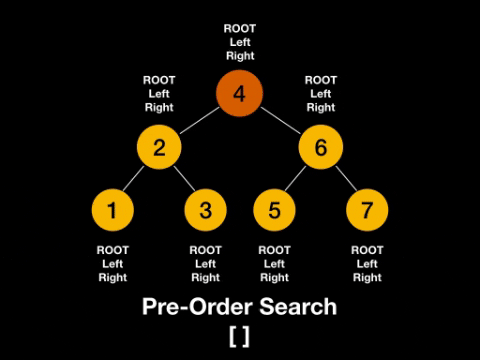

## Singly linked list


#### Implementation

```js
class Node {
  constructor(val) {
    this.val = val;
    this.next = null;
  }
}
```

```js
class SinglyLinkedList {
  constructor() {
    this.head = null;
    this.tail = null;
    this.length = 0;
  }
   /* 
   * get, set
   * push, pop
   * shift, unshift
   * /
}
```

#### Usage

- build Stack and Queue
- undo functionality in programs

## Doubly linked list


#### Implementation

```js
class Node {
  constructor(val) {
    this.val = val;
    this.next = null;
    this.prev = null;
  }
}
```

```js
class DoublyLinkedList {
  constructor() {
    this.head = null;
    this.tail = null;
    this.length = 0;
  }
  /* 
   * get, set
   * push, pop
   * shift, unshift
   * /
}
```

#### Usage

- browser history
- undo and redo functionality in programs

## Stack


#### Implementation

- via Array
- via Singly Linked List
  - `push()` via `unshift()`
  - `pop()` via `shift()`
  


#### Usage

- javascript call stack
- undo/redo in Photoshop
- routing in javascript frameworks

## Queue


#### Implementation

- via Array
- via Singly Linked List
  - `enqueue()` via `push()`
  - `dequeue()` via `shift()`


#### Usage

- printing

## Binary search tree

#### Implementation

```js
class Node {
  constructor(val) {
    this.val = val;
    this.left = null;
    this.right = null;
  }
}
```

```js
class BinarySearchTree {
  constructor() {
    this.root = null;
  }
  /* 
   * insert, find, contains 
   * bfs, dfs
   * preOrder, postOrder, inOrder
   * /
}
```
#### BFS


#### DFS Pre Order



#### DFS Post Order


#### DFS In Order


#### Usage

- printing

## Graph

| Adjacency List                     | Adjacency Matrix                   |
| ---------------------------------- | ---------------------------------- |
| Less space                         | More space                         |
| Fast to iterate over all edges     | Slow to iterate over all edges     |
| Slow to lookup for a specific edge | Fast to lookup for a specific edge |
