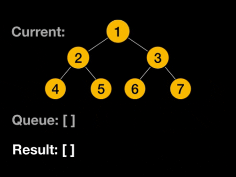
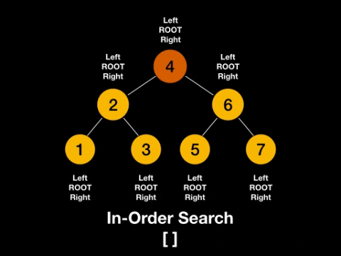

## Singly linked list


#### Implementation

```js
class Node {
  constructor(val) {
    this.val = val;
    this.next = null;
  }
}
```

```js
class SinglyLinkedList {
  constructor() {
    this.head = null;
    this.tail = null;
    this.length = 0;
  }
   /*
   * get, set
   * push, pop
   * shift, unshift
   * /
}
```

#### Usage

- build Stack and Queue
- undo functionality in programs

## Doubly linked list


#### Implementation

```js
class Node {
  constructor(val) {
    this.val = val;
    this.next = null;
    this.prev = null;
  }
}
```

```js
class DoublyLinkedList {
  constructor() {
    this.head = null;
    this.tail = null;
    this.length = 0;
  }
  /*
   * get, set
   * push, pop
   * shift, unshift
   * /
}
```

#### Usage

- browser history
- undo and redo functionality in programs

## Stack


#### Implementation

- via Array
- via Singly Linked List

  - `push()` via `unshift()`
  - `pop()` via `shift()`


#### Usage

- javascript call stack
- undo/redo in Photoshop
- routing in javascript frameworks

## Queue


#### Implementation

- via Array
- via Singly Linked List
  - `enqueue()` via `push()`
  - `dequeue()` via `shift()`


#### Usage

- printing

## Binary search tree

#### Implementation

```js
class Node {
  constructor(val) {
    this.val = val;
    this.left = null;
    this.right = null;
  }
}
```

```js
class BinarySearchTree {
  constructor() {
    this.root = null;
  }
  /*
   * insert, find, contains
   * bfs, dfs
   * preOrder, postOrder, inOrder
   * /
}
```

### BFS



#### Implementation

- based on Queue

```js
bfs() {

  let node = this.root;
  const result = [];
  const queue = [node];

  while (queue.length) {
    node = queue.shift(); 
    result.push(node.val);
    if (node.left) queue.push(node.left);
    if (node.right) queue.push(node.right);
  }

  return result;

}

var tree = new BinarySearchTree();

tree.insert(10);
// insert more...

tree.bfs(); 
```

#### DFS



#### Implementation

- based on recursion

```js
dfs() {

  const result = [];

  function traverse(node) {
    // result.push(node.val); -> pre-order
    if (node.left) traverse(node.left);
    // result.push(node.val); -> in-order
    if (node.right) traverse(node.right);
    // result.push(node.val); -> post-order
  };

  traverse(this.root);

  return result;

}

var tree = new BinarySearchTree();

tree.insert(10);
// insert more...

tree.dfs(); 
```

## Graph

| Adjacency List                     | Adjacency Matrix                   |
| ---------------------------------- | ---------------------------------- |
| Less space                         | More space                         |
| Fast to iterate over all edges     | Slow to iterate over all edges     |
| Slow to lookup for a specific edge | Fast to lookup for a specific edge |
