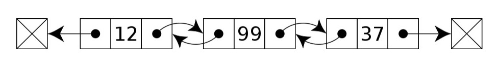
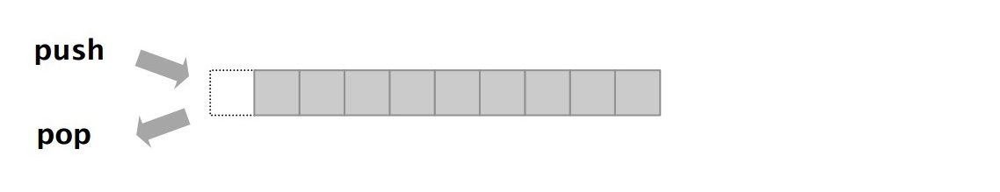
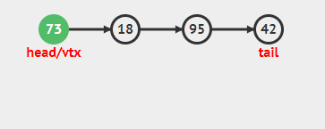
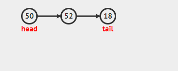
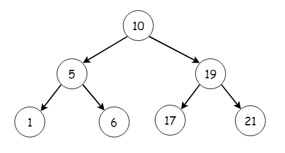
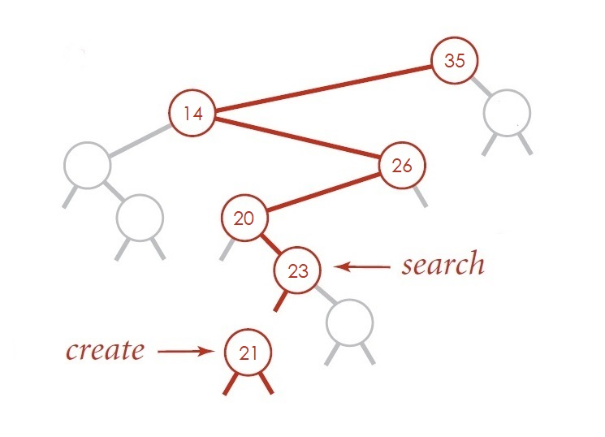
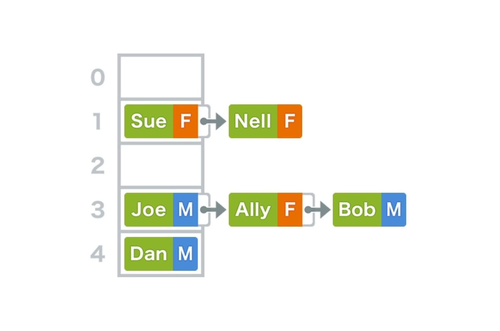
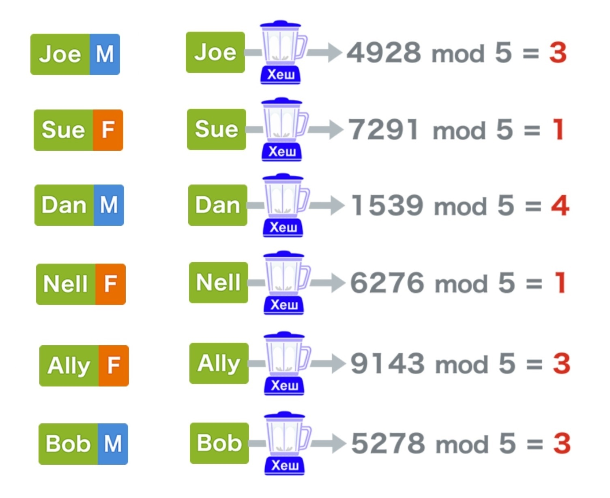

## Singly linked list


<details>
<summary>Implementation</summary>

```js
class Node {
  constructor(val) {
    this.val = val;
    this.next = null;
  }
}
```

```js
class SinglyLinkedList {
  constructor() {
    this.head = null;
    this.tail = null;
    this.length = 0;
  }
   /*
   * get, set
   * push, pop
   * shift, unshift
   * /
}
```

</details>

#### Usage

- build Stack and Queue
- undo functionality in programs

## Doubly linked list



<details>
<summary>Implementation</summary>

```js
class Node {
  constructor(val) {
    this.val = val;
    this.next = null;
    this.prev = null;
  }
}
```

```js
class DoublyLinkedList {
  constructor() {
    this.head = null;
    this.tail = null;
    this.length = 0;
  }
  /*
   * get, set
   * push, pop
   * shift, unshift
   * /
}
```

</details>

#### Usage

- browser history
- undo and redo functionality in programs

## Stack



<details>
<summary>Implementation</summary>

- via Array
- via Singly Linked List

  - `push()` via `unshift()`
  - `pop()` via `shift()`



</details>

#### Usage

- javascript call stack
- undo/redo in Photoshop
- routing in javascript frameworks

## Queue


<details>
<summary>Implementation</summary>

- via Array
- via Singly Linked List
  - `enqueue()` via `push()`
  - `dequeue()` via `shift()`



</details>

#### Usage

- printing

## Binary search tree



<details>
<summary>Implementation</summary>

```js
class Node {
  constructor(val) {
    this.val = val;
    this.left = null;
    this.right = null;
  }
}
```

```js
class BinarySearchTree {
  constructor() {
    this.root = null;
  }
  /*
   * insert, find, contains
   * bfs, dfs
   * preOrder, postOrder, inOrder
   * /
}
```



Example

```js
{
  "root": {
    "value": 10,
    "left": {
      "value": 6,
      "left": {
        "value": 3,
        "left": null,
        "right": null
      },
      "right": {
        "value": 8,
        "left": null,
        "right": null
      }
    },
    "right": {
      "value": 15,
      "left": null,
      "right": {
        "value": 20,
        "left": null,
        "right": null
      }
    }
  }
}
```

</details>

#### Usage

- database indexing and search
- Huffman coding algorithm (file compression)
- Array can be converted to BST
- much faster than `Array` at search, insert, and delete (does not store indices unlike `Array`)
  - Array O(n)
  - BST O(log n)
- mcuh slower than `Array` at access
  - Array O(1)
  - BST O(log n)

## Hash table



<details>
<summary>Implementation</summary>



Example

```js
const hashTable = {
  keyMap: [
    null, 
    [['Sue', 'F'], ['Nell', 'F']], 
    null,
    [['Joe', 'M'], ['Ally', 'F'], ['Bob', 'M']],
    [['Dan', 'M']]
  ];
}
```

```js
class HashTable {
  constructor(size = 5) {
    this.keyMap = new Array(size);
    // this = { keyMap: [ , , , , ] }
  }

  _hash(key) {
    // return 3
  }

  set(key, value) {
    // [ , , [ 'Joe', 'M' ] , , ]
  }

  get(key) {
    // "M"
  }
}

let ht = new HashTable(5);

ht.set("Joe", "M");
// add more...
```

</details>

#### Usage

- efficiently lookup without relying on a linear search
- much faster than `Array` at search, insert, and delete
  - Array O(n)
  - Hash Table O(1)
- search citizen passport record by ID
  - Array
    - check every ID starting from `1` untill, let's say, `9999`
  - Hash Table
    - convert `Vladimir Putin` to `1002` and directly access it

## Graph

| Adjacency List                     | Adjacency Matrix                   |
| ---------------------------------- | ---------------------------------- |
| Less space                         | More space                         |
| Fast to iterate over all edges     | Slow to iterate over all edges     |
| Slow to lookup for a specific edge | Fast to lookup for a specific edge |
