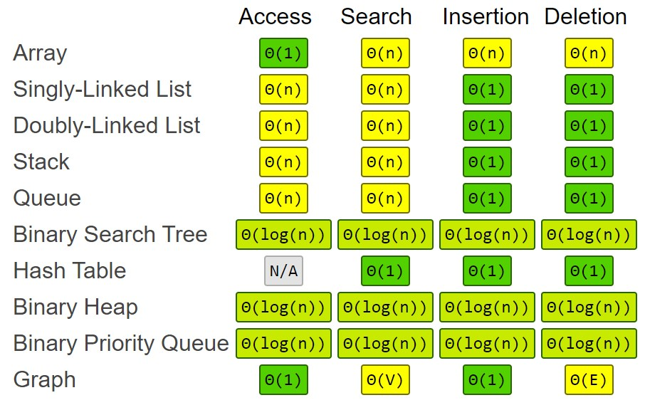

## Singly linked list


```js
const singlyLinkedList = {
  head: {
    value: 12,
    next: {
      value: 99,
      next: {
        value: 37,
        next: null,
      },
    },
  },
  tail: {
    value: 37,
    next: null,
  },
  length: 3,
};
```

<details>
<summary>Implementation</summary>

```js
class Node {
  constructor(value) {
    this.value = value;
    this.next = null;
  }
}
```

```js
class SinglyLinkedList {
  constructor() {
    this.head = null;
    this.tail = null;
    this.length = 0;
  }
   /*
   * get, set
   * push, pop
   * shift, unshift
   * /
}
```

</details>

<details>
<summary>Usage</summary>

- build Stack and Queue

- solve the issue of static arrays

  _back in history, Linked Lists were created to solve the issue of static arrays, where size (and therefore memory) must be allocated at compile time, which in the case of Linked Lists grows dynamicaly at runtime_

- undo functionality with no jump-overs

  _use when you want to gurarntee an order, without possibility to jump over (editing history in Photoshop, browser history)_

- order-sensitive data  

  _voicemails_

</details>

<details>
<summary>Complexity</summary>



**N/A** - you could pick the i-th element in the underlying array, that would have no meaning at all

</details>

## Doubly linked list


```js
const doublyLinkedList = {
  head: {
    value: 12,
    next: {
      value: 99,
      next: {
        value: 37,
        next: null,
        prev: "[Circular]",
      },
      prev: "[Circular]",
    },
    prev: null,
  },
  tail: {
    value: 37,
    next: null,
    prev: {
      value: 99,
      next: "[Circular]",
      prev: {
        value: 12,
        next: "[Circular]",
        prev: null,
      },
    },
  },
  length: 3,
};
```

<details>
<summary>Implementation</summary>

```js
class Node {
  constructor(val) {
    this.val = val;
    this.next = null;
    this.prev = null;
  }
}
```

```js
class DoublyLinkedList {
  constructor() {
    this.head = null;
    this.tail = null;
    this.length = 0;
  }
  /*
   * get, set
   * push, pop
   * shift, unshift
   * /
}
```

</details>

<details>
<summary>Usage</summary>

- see [Singly linked list](#Singly-linked-list)
- undo and redo functionality in programs

</details>

<details>
<summary>Complexity</summary>


**N/A** - you could pick the i-th element in the underlying array, that would have no meaning at all

</details>

## Stack


```js
const stack = {
  head: {
    value: 12,
    next: {
      value: 99,
      next: {
        value: 37,
        next: null,
      },
    },
  },
  tail: {
    value: 37,
    next: null,
  },
  length: 3,
};

// or

const stack = [12, 99, 37];
```

<details>
<summary>Implementation</summary>

- via Array

- via Singly Linked List

```js
import SinglyLinkedList from "SinglyLinkedList";

class Stack {
  constructor() {
    this.queue = new SinglyLinkedList();
  }

  push(value) {
    this.queue.unshift(value);
  }

  pop() {
    this.queue.shift();
  }
}
```


</details>

<details>
<summary>Usage</summary>

- javascript call stack
- undo/redo in Photoshop
- routing in javascript frameworks

</details>

<details>
<summary>Complexity</summary>


**N/A** - you could pick the i-th element in the underlying array, that would have no meaning at all

</details>

## Queue


```js
const stack = {
  head: {
    value: 12,
    next: {
      value: 99,
      next: {
        value: 37,
        next: null,
      },
    },
  },
  tail: {
    value: 37,
    next: null,
  },
  length: 3,
};

// or

const stack = [12, 99, 37];
```

<details>
<summary>Implementation</summary>

- via Array

- via Singly Linked List

```js
import SinglyLinkedList from "SinglyLinkedList";

class Stack {
  constructor() {
    this.stack = new SinglyLinkedList();
  }

  enqueue(value) {
    this.stack.push(value);
  }

  dequeue() {
    this.stack.shift();
  }
}
```


</details>

<details>
<summary>Usage</summary>

- printing

</details>

<details>
<summary>Complexity</summary>


**N/A** - you could pick the i-th element in the underlying array, that would have no meaning at all

</details>

## Binary search tree


```js
const binarySearchTree = {
  root: {
    value: 10,
    left: {
      value: 6,
      left: {
        value: 3,
        left: null,
        right: null,
      },
      right: {
        value: 8,
        left: null,
        right: null,
      },
    },
    right: {
      value: 15,
      left: null,
      right: {
        value: 20,
        left: null,
        right: null,
      },
    },
  },
};
```

<details>
<summary>Implementation</summary>

```js
class Node {
  constructor(val) {
    this.val = val;
    this.left = null;
    this.right = null;
  }
}
```

```js
class BinarySearchTree {
  constructor() {
    this.root = null;
  }
  /*
   * insert, find, contains
   * bfs, dfs
   * preOrder, postOrder, inOrder
   * /
}
  
function buildTree(depth, word) {
  // create null pointers on ends
  if (depth === 0) return null;

  // create root
  const node = new Node(depth);

  // create left
  node.left = buildTree(depth-1, 'left');

  // create right
  node.right = buildTree(depth-1, 'right');

  // retrun the tree
  return node;
}
```


</details>

<details>
<summary>Usage</summary>

- database indexing and search
- Huffman coding algorithm (file compression)
- Array can be converted to BST
- much faster than `Array` at search, insert, and delete (does not store indices unlike `Array`)
  - Array O(n)
  - BST O(log n)
- mcuh slower than `Array` at access
  - Array O(1)
  - BST O(log n)

</details>

<details>
<summary>Complexity</summary>


**N/A** - you could pick the i-th element in the underlying array, that would have no meaning at all

</details>

## Hash table


```js
const hashTable = {
  keyMap: [
    null,
    [['Sue', 'F'], ['Nell', 'F']],
    null,
    [['Joe', 'M'], ['Ally', 'F'], ['Bob', 'M']],
    [['Dan', 'M']]
  ];
}
```

<details>
<summary>Implementation</summary>


```js
class HashTable {
  constructor(size = 5) {
    this.keyMap = new Array(size);
    // this = { keyMap: [ , , , , ] }
  }

  _hash(key) {
    // return 3
  }

  set(key, value) {
    // [ , , [ 'Joe', 'M' ] , , ]
  }

  get(key) {
    // "M"
  }
}

let ht = new HashTable(5);

ht.set("Joe", "M");
// add more...
```

</details>

<details>
<summary>Usage</summary>

- efficiently lookup without relying on a linear search
- much faster than `Array` at search, insert, and delete
  - Array O(n)
  - Hash Table O(1)
- search in Ski Rent by shoes size

</details>

<details>
<summary>Complexity</summary>


**N/A** - you could pick the i-th element in the underlying array, that would have no meaning at all

</details>

## Heap


```js
const heap = {
  arr: [100, 19, 36, 17, 12, 25, 5],
};
```

<details>
<summary>Implementation</summary>

```js
class MaxHeap {
  constructor() {
    this.heap = [];
  }

  getLeftChildIndex(i) {
    return i * 2 + 1;
  }

  getRightChildIndex(i) {
    return i * 2 + 2;
  }

  getParentIndex(i) {
    return Math.floor((i - 1) / 2);
  }

  swap(i1, i2) {
    [this.heap[i1],this.heap[i2]] = [this.heap[i2], this.heap[i1]];
  }

  add(value) {
    // 1. push to the end
    // 2. compare with parent and if bigger - swap
    // 3. repeat until correct position
  
    this.heap.push(value);
    this.bubbleUp();
  }

  remove() {
    // 1. remove head (max) and put tail (smallest) as new head
    // 2. compare head with children and with smallest - swap
    // 3. repeat until correct position
  
    // replace top with last
    this.heap[0] = this.heap.pop();

    // re-heapify
    this.sinkDown();
  }

  bubbleUp() {
    let currentIndex = this.heap.length - 1;

    // until out current is bigger than parent, we need to swap them
    while (this.heap[currentIndex] > this.heap[this.getParentIndex(currentIndex)]) {
      this.swap(currentIndex, this.getParentIndex(currentIndex));

      // update current index to repeat
      currentIndex = this.getParentIndex(currentIndex);
    }
  }

  sinkDown() {
    let currentIndex = 0;

    // as long as we have left child
    while (this.heap[this.getLeftChildIndex(currentIndex)] !== undefined) {

      /********* START - find biggest child *********/
      
      // check left
      let biggestChildIndex = this.getLeftChildIndex(currentIndex);

      // check right
      if (this.heap[this.getRightChildIndex(currentIndex)] !== undefined
        && (this.heap[this.getRightChildIndex(currentIndex)] > this.heap[this.getLeftChildIndex(currentIndex)])) {
        biggestChildIndex = this.getRightChildIndex(currentIndex);
      }

      /********* END - find biggest child *********/

      // replace current with biggest child
      if (this.heap[currentIndex] < this.heap[biggestChildIndex]) {
        this.swap(currentIndex, biggestChildIndex);
        
        // update current index to repeat
        currentIndex = biggestChildIndex;
      } else {
        return;
      }
      
    }
  }
}
```

</details>

<details>
<summary>Usage</summary>

- much faster than `Array` at getting the minimum or the maximum value
  - Linked List O(n)
  - Array O(n)
  - Heap O(1)
- OS use heaps for scheduling jobs on a priority basis
- to build Priority Queue
  - if you have a FastPass ticket you can bypass the entire line
  - handicapped individuals are taken to the front of the line
- does not support the searching operations

</details>

<details>
<summary>Complexity</summary>


**N/A** - you could pick the i-th element in the underlying array, that would have no meaning at all

</details>

## Priority queue


```js
const priorityQueue = {
  arr: [
    {
      value: "Breath",
      priority: 100,
    },
    {
      value: "Eat",
      priority: 19,
    },
    {
      value: "Drink",
      priority: 36,
    },
    {
      value: "Sleep",
      priority: 17,
    },
    {
      value: "Read",
      priority: 12,
    },
    {
      value: "Speak",
      priority: 25,
    },
    {
      value: "Pray",
      priority: 5,
    },
  ],
};
```

<details>
<summary>Implementation</summary>

```js
class Node {
  constructor(val, priority) {
    this.val = val;
    this.priority = priority;
  }
}

class MaxPriorityQueue {
  constructor() {
    this.arr = [];
  }

  // same as max/min heap...
}

let queue = new MaxPriorityQueue();

queue.enqueue("Breath", 100);
// add more...
```

</details>

<details>
<summary>Usage</summary>

- OS processes
- Insertion and removal O (log n) - binary tree, logarithmic number of comparisons
- Search O(n) - not designed for search

</details>

<details>
<summary>Complexity</summary>


**N/A** - you could pick the i-th element in the underlying array, that would have no meaning at all

</details>

## Graph


```js
const graph = {
  adjList: {
    A: ["B", "C"],
    B: ["A", "D"],
    C: ["A", "E"],
    D: ["B", "E", "F"],
    E: ["C", "D", "F"],
    F: ["D", "E"],
  },
};
```

<details>
<summary>Implementation</summary>

```js
class Graph {
  constructor() {
    this.adjList = {};
  }

  // addVertex, addEdge, removeEdge, removeVertex
  // dfs, bfs
}

let g = new Graph();

g.addVertex("A");
// add more...
```

</details>

<details>
<summary>Complexity</summary>


**N/A** - you could pick the i-th element in the underlying array, that would have no meaning at all

</details>
