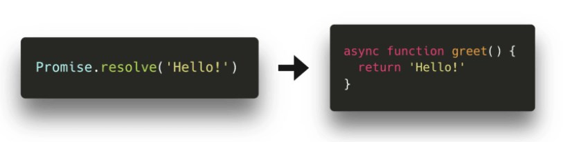

## Keyword `async`



- makes `function` return a promise.

- allows `await` to be used in it

## Error handling

```js
async function getData() {
  try {
    let response = await fetch("http://no-such-url");
  } catch (err) {
    alert(err);
  }
}

getData();
```

## Keywords `await for ... of`

```js
async function getData() {
  const requests = [
    fetch("http:/url1"),
    fetch("http:/url2"),
    fetch("http:/url3"),
  ];

  for await (let request of requests) {
    // request.json() returns Promise!
    const data = await request.json();
  }
}

getData();
```

## Parallel

```js
async function parallel() {
  const requests = [
    fetch("https://jsonplaceholder.typicode.com/users"),
    fetch("https://jsonplaceholder.typicode.com/posts"),
    fetch("https://jsonplaceholder.typicode.com/albums"),
  ];

  const [output1, output2, output3] = await Promise.all(requests);

  return `${output1}, ${output2}, ${output3}`;
}

parallel().then(console.log)
```

## Race

```js
async function race() {
  const requests = [
    fetch("https://jsonplaceholder.typicode.com/users"),
    fetch("https://jsonplaceholder.typicode.com/posts"),
    fetch("https://jsonplaceholder.typicode.com/albums"),
  ];

  const output = await Promise.race(requests);

  return `${output}`;
}

race().then(console.log)
```

## Sequence

```js
async function sequence() {
  const output1 = await fetch("https://jsonplaceholder.typicode.com/users");
  const output2 = await fetch("https://jsonplaceholder.typicode.com/posts");
  const output3 = await fetch("https://jsonplaceholder.typicode.com/albums");

  return `${output1}, ${output2}, ${output3}`;
}

sequence().then(console.log)
```
